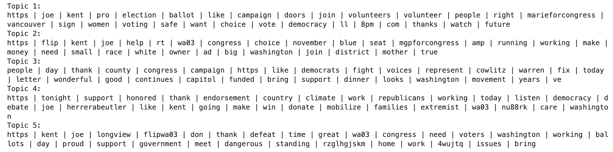
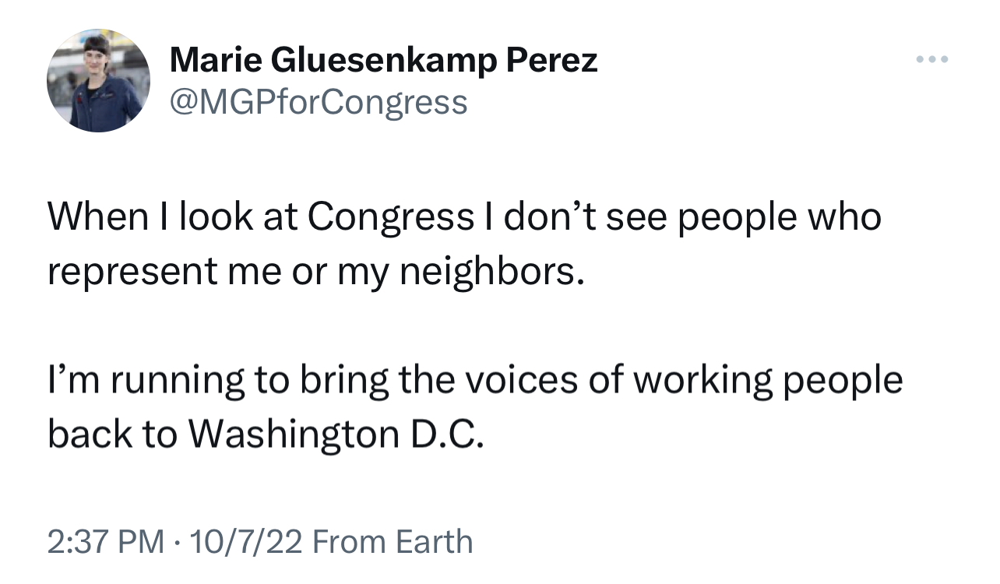
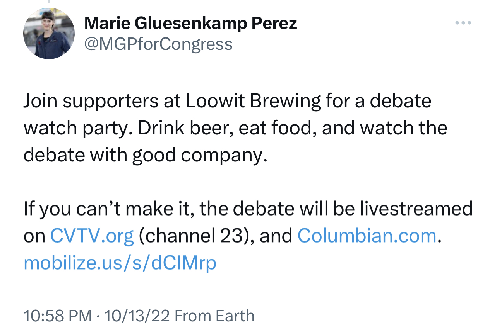
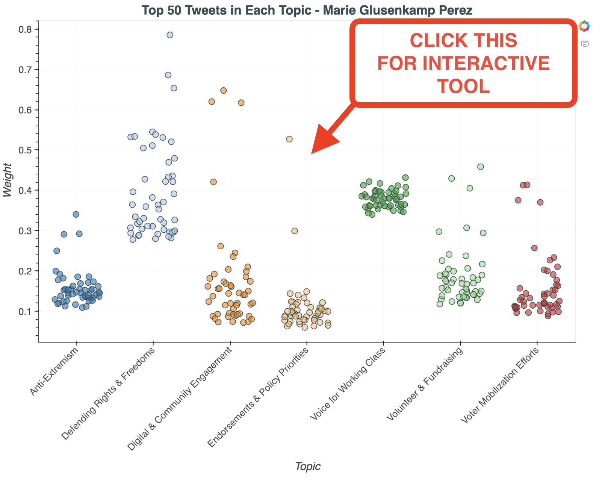
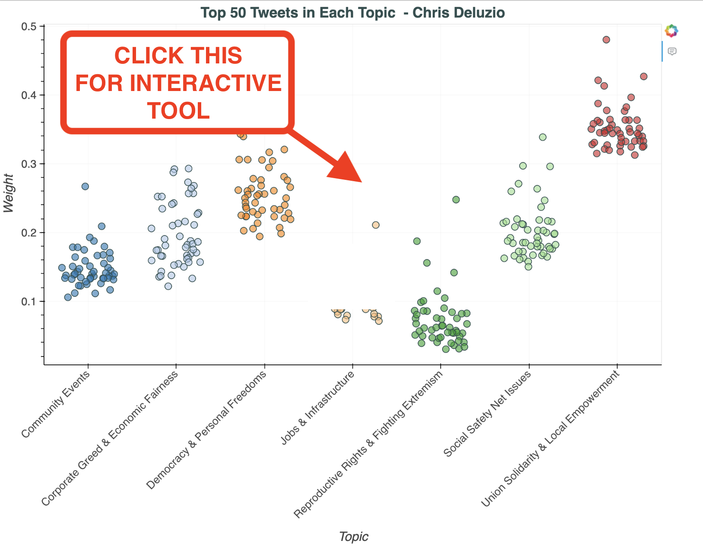

  
<h2 align="center">           </h2>

<h2 align="center">Winning in Trump Country</h2>

  

<h3 align="center">Examining the Twitter Messaging Strategies of Two Democratic Newcomers Who Overcame the Red Tide in the 2022 Midterms </h3>

  
<!-- TABLE OF CONTENTS -->
<!--details-->
  
 Table of Contents 

  <ol>
    <li>
      <a href="#introduction">Introduction</a>
    </li>
    <li>
      <a href="#methodology">Methodology</a>
    </li>
    <li>
      <a href="#data-used">Data Used</a>
    </li>
    <li><a href="#selecting-the-candidates">Selecting the Candidates</a></li>
    <li><a href="#114th-congress-tweet-sentiment-classification">114th Congress Tweet Sentiment Classification</a></li>
    <li><a href="#unsupervised-topic-modeling">Unsupervised Topic Modeling</a></li>
    <li><a href="topic-comparisons-between-candidates">Topic Comparisons between Candidates</a></li>
    <li><a href="#insights-and-conclusions">Insights and Conclusions</a></li>
    <li><a href="#future-work">Future Work</a></li>
    <li><a href="#acknowledgments">Acknowledgments</a></li>
   </ol>
<!--/details-->

## Introduction

 This project applies Natural Language Processing (NLP) techniques to analyze the twitter messaging strategies of Marie Glusenkamp Perez (WA-03) and Chris Deluzio (PA-17), Democratic newcomers competing in two of the most challenging districts for Democrats in the 2022 midterm cycle. 
 
 Given the 2022 midterms were marked by the defeats of many election deniers and January 6th apologists, a secondary focus of this study is to assess the difference in our candidates' messaging strategies against distinct types of opponents— one faced Joe Kent in WA, a 'Kooky' nominee who fully embraced the 2020 election conspiracies, and the other faced Jeremy Shaffer in PA, a mainstream Republican who reluctantly acknowledged Joe Biden's 2020 victory (after desperately trying to avoid the question altogether). 
 
 
(<a href="#readme-top">back to top</a>)

 
## Methodology
 
I used classification models to analyze a dataset of 5000 Twitter and Facebook posts by members of the 114th Congress. The dataset was pre-labeled with categories including bias, message nature, and political affiliation. My goal was to train the models to classify tweets based on these labels, which I then applied to my two candidates' tweets leading up to the 2022 midterm elections.
 
I also applied unsupervised topic modeling techniques, beginning with Latent Dirichlet Allocation (LDA) as a baseline method and then using Non-Negative Matrix Factorization (NMF) on Twitter GloVe vectors for refined clustering. After generating the topic groupings, I searched through each candidate's Tweet corpus for words closely associated with these topics to compare how often each candidate messaged on these topics to assiss differing strategies. I used cosine similarity calculations within the tweet vector space to determine which words were most semantically similar in each topic. 

(<a href="#readme-top">back to top</a>)

## Data Used
1. PVI score data was sourced from the [Cook Political Report](https://www.cookpolitical.com/cook-pvi/2023-partisan-voting-index/118-district-map-and-list).
2. 2022 Midterm Results were sourced from [The Daily Kos](https://www.dailykos.com/stories/2022/9/21/1742660/-The-ultimate-Daily-Kos-Elections-guide-to-all-of-our-data-sets).
3. The campaign tweets from Marie Glusenkamp Perez and Chris Deluzio were hand-copied from their twitter accounts [@MGPforCongress](https://twitter.com/mgpforcongress) and [@ChrisforPA](https://twitter.com/chrisforPA)

4. The 114th Congress tweets addended with characterization inputs was sourced from Crowdflower's Data For Everyone Library via [Kaggle](https://www.kaggle.com/datasets/crowdflower/political-social-media-posts/data).

5. GloVe models and vectors https://nlp.stanford.edu/projects/glove/

(<a href="#readme-top">back to top</a>)

## Selecting the Candidates

**SYNOPSIS:** I determined which candidates to focus on through comparing their 2022 electoral margins with their district's Partisan Voter Index scores (PVI). I ultimately landed on Marie Glusenkamp Perez in WA-03, and Chris Deluzio in PA-17. Below documents the step-by-step process of determining the candidates of focus 

<b><big>Expand for Detailed Walk-Through Below</big></b>

To identify standout candidates, I devised a 'Performance' metric by calculating the difference between each district's Partisan Voter Index (PVI) and the candidate's electoral margin in 2022. PVI measures how partisan the district is compared to the nation as a whole, based on how the constituents of those districts voted in previous presidential elections. This approach identified those who significantly outperformed their district's typical partisan lean.

Of the top 18 overperforming candidates indicated in the graph above by district title, I narrowed my focus to first-time candidates to avoid any influence of incumbency effects. Mary Peltola from Alaska was also excluded due to the state's use of Ranked Choice Voting, which, while I am personally a fan of RCV, complicates direct comparison of candidates in this context.  

That left me with 6 candidates to consider, all having overperformed their districts' partisan lean by at least 5 points.  The following 4 candidates greatly overperformed in their districts, but were eliminated from consideration for various reasons:

Emilia Sykes would have been fun to analyze (and I love her glasses), but she deleted her campaign account following the election. Adam Frisch, who just barely fell short of victory in CO-03, was initially a candidate of interest, but was excluded due to the sheer volume of his tweets, which, thanks to Elon Musk's recent termination of free API access for Twitter, made data collection too labor-intensive. 

But ultimately, I found myself drawn to the candidate who arguably pulled off the biggest flip of the midterms. Her unique campaign and distinctive messaging strategy provided ample material for analysis, ultimately leading me to...

Marie Glusenkamp Perez! She faced cuckoo-bird Joe Kent, who expressed some extreme views like supporting the arrest of Dr. Anthony Fauci and endorsing the claims of a stolen 2020 election. In fact, he became the candidate for WA-03 after successfully primarying the serving Republican Congressperson, Jaime Herrera Beutler, one of only 10 republicans who voted to impeach Donald Trump following the events of January 6th. 

The next candidate I wanted to assess took a little more research to come to a decision, but I wanted to find a Democrat who overperformed in their district, while contending against an opponent who was a more mainstream Republican. I landed on...

Chris Deluzio! He competed in a pure toss-up district and significantly outperformed against Jeremy Shaffer, who notably tried to sidestep affirming or denying the 2020 election fraud claims, and even released an ad promising to "protect women's healthcare."  

### Tweet Collection
As mentioned before, the termination of free API access meant manually compiling tweets for Chris Deluzio and Marie Glusenkamp Perez, and then using a custom parsing script to organize and format these tweets into a structured dataset for analysis. Tweets were manually copied, separated by a '|' delimiter, and then organized into a corpus of around 1000 total tweets. [candidate notebook](MGP and Delozio.ipynb).

(<a href="#readme-top">back to top</a>)

## 114th Congress Tweet Sentiment Classification

Diving into this 2013-2014 dataset of politicians' social media felt like sorting through a cursed time capsule—fascinating, nostalgic, but ultimately reflecting an unrecognizable reality. Many of the key players in Congress, whose tweets I wrangled here, have fizzled or been replaced. And among the 5000 posts, not a single mention of 'Donald Trump'.

While the dataset does have its utility, its limitations were overwhelming. Nonetheless, for this exercise, I used some advanced classification modeling techniques to attempt to extract insights. The details are outlined below for those interested in the gritty process. The next section, however, is where we'll dive into the more interesting and fruitful analysis.

<b><big>Detailed Process (For the Curious)</big></b>

The dataset of 5000 tweets from 114th Congress members immediately presented a challenge: each tweet was tagged as "partisan" or "neutral," but provided no information on the political party of the tweeter. The data was presented like this:

| label |
| :----------- |
| From: Mitch McConnell (Senator from Kentucky) |
| From: Kurt Schrader (Representative from Oregon) |
| From: Michael Crapo (Senator from Idaho) |

To address this, I used this comprehensive member list from the [C-span 114th Summary Page](https://www.c-span.org/congress/members/?chamber=house&congress=114&all), including images, to match members' names and extract their partisan affiliation. The parsing code developed involved removal of name suffixes and resolving ambiguities in cases of shared last names, such as distinguishing between Rob Bishop (UT-01) and Mike Bishop (MI-08). 

After the data was addended to include each tweeter's political affilitation, several machine learning models were trained to classify tweets based on partisanship and content. This process encorporated Natural Language Processing (NLP) techniques, including TF-IDF vectorization for feature extraction and the application of multiple classifiers such as RandomForest, Naive Bayes, SVM, and Neural Networks within a pipeline structure optimized through GridSearchCV for hyperparameter tuning. 

The optimal models for each classification target—Party, Bias, and Message—were determined based on F1 scores and accuracy. Below are the best-performing models for each category, along with their respective confusion matrices:

- **Bias Prediction**: The Gaussian Naive Bayes Model emerged as the top performer for distinguishing between partisan and neutral tweets.
- **Party Affiliation Prediction**: The Multi-Layer Perceptron Classifier, a type of basic feedforward artificial neural network, was most effective in identifying the political party.
- **Message Category Prediction**: Gaussian Naive Bayes also proved to be the best model for categorizing the content of the tweets.

Word2Vec embeddings were able to enhancing the models' accuracy slightly. The final models were decent at discerning party affiliation, distinguishing between neutral and partisan messages, and categorizing the underlying message themes. 

These models were then applied to analyze the tweets of Marie Glusenkamp Perez (MGP) and Chris Deluzio, in order to shed light on their campaign messaging strategies in the following section.

(<a href="#readme-top">back to top</a>)

## Analyzing Tweets with Trained Models

After fine-tuning the models on the 114th Congress dataset, I turned my attention to the real test: analyzing the campaign messages of Marie Glusenkamp Perez (MGP) and Chris Deluzio. Here's the process:

### Analysis Workflow -- From Raw Tweets to Insights
#### Preprocessing Tweets:
Before feeding the tweets into the trained models, the corpus of each candidate was preprocessed:
1. **Tokenization**: The tweets were broken into individual words or 'tokens', making it easier for our models to analyze the text.
2. **Word Averaging with Word2Vec**: 
    - Word2Vec is a model that transforms words into vectors, capturing the semantic relationships between them. For example, Word2Vec understands that 'king' and 'queen' are related in a similar way as 'man' and 'woman'.
    - Word2Vec was used to convert the tokens into vectors, then averaged these vectors for each tweet. This process resulted in a numerical representation that captures the essence of each tweet, while making it digestible for machine learning models.
    - **Note on Lemmatization**: Typically, natural language processing might include a lemmatization step, where words are reduced to their base or 'lemma' (e.g., "running" becomes "run"). However, Word2Vec has the ability to discern the semantic meaning of words in their various forms, so I opted not to lemmatize our tokens. This allows us to retain the variations in the language used in the tweets.

### Normalization and Comparison:
Normalization was applied to the data for a balanced comparison of MGP's and Deluzio's messaging strategies: 
Balancing Volumes-- Due to the different numbers of tweets from each candidate, normalization allowed us to make comparisons based on tweet category proportions, not just total counts.

#### Visualization Analysis and Classifier Performance:

After classifying the tweets and normalizing the data, we employed visualizations to examine the differences in messaging strategies between Marie Glusenkamp Perez and Chris Deluzio. Each visualization offers insights into specific aspects of their Twitter engagement, based on their classification results.

1. **Message Categories**: 

The distribution of tweets across different message categories (e.g., 'policy', 'attack', 'media') provides insights into the focal points of each candidate's campaign. For example, a higher proportion of 'policy' tweets might indicate a campaign centered on substantive issues, while 'attack' tweets suggest a more confrontational approach.

2. **Partisan vs. Neutral Messages**: Visualizing the split between partisan and neutral tweets can reveal how each candidate balances broad appeal with targeted messaging to their base.

3. **Party Affiliation Predictions**: This visualization might show the predicted party alignment of tweets, offering a perspective on how closely each candidate aligns with their party's typical messaging.

**Performance Caveats**:
It's crucial to note the limitations in classifier performance when interpreting these visualizations. For instance, the 'message' category classifier achieved an accuracy of approximately 36.7%, with varying precision and recall across categories. This variability suggests that while some insights can be gleaned from the classified data, the findings should be taken with caution.

- Categories like 'personal' and 'policy' showed relatively better performance, but this was mostly due to the fact that the dataset was highly imbalanced. Since most of the messages were tagged as 'policy' and 'personal', the models learned to more often predict these categories 
- Categories with lower precision and recall, such as 'constituency' and 'other', had low classification reliability.

The model accuracy is severely limited on the data it was trained on. Due to the human-labeling process for this dataset, the errors and judgments by the topic labelers pass through the model during training, complicated futher by the large imbalance of the labels in certain categories. This problem is exacerbated during the prediction of tweets outside the 114th Congress dataset when introducing the tweetset of Marie Glusenkamp Perez and Chris Deluzio. This issue could be mitigated by introducing the model to more data, more current data, and balancing along categories. This would be preferable to reduce the data dependency of the model and increase the robustness for general purposes.

While the visualizations provide a structured way to explore the candidates' messaging, the underlying limitations necessitate the use of different NLP techniques to glean important strategy insights. 

(<a href="#readme-top">back to top</a>)

## Unsupervised Topic Modeling

### Latent Dirichlet Allocation (LDA) on Term Frequency-Inverse Document Frequency (TF-IDF)

As a baseline, I used Latent Dirichlet Allocation (LDA) on Term Frequency-Inverse Document Frequency (TF-IDF) to analyze my candidates' tweets. TF-IDF measures the importance of words in a document (tweet) relative to the corpus (collection of all tweets in the campaign season). However, with only 1000 already-short tweets, LDA's effectiveness may be limited, and so I used this method as a baseline topic modeling method for comparison. 

LDA uses these term frequencies to search for patterns and group things together into topics it thinks are related. It's up to the user to interpret these topics and discern underlying patterns. 

Sorting Marie Glusenkamp Perez's tweetset into 5 topics appeared to work best after experimenting with different number of topics and reviewing the results. Below are the key words associated with each topic for MGP:

It seems like Topic 1 involves canvassing and GOTV messaging with terms like "volunteer", "join", "doors", "Vancouver" (big population center in the district where running up turnout numbers would be important to win). The other topics' words offer some hints at overarching themes, but it's still not as easy to discern as the first topic. But again, LDA topic modeling shouldn't be too sophisticated given our small corpi and short documents. 

TF-IDF scores words based on frequency and rarity, then LDA identifies topics based on these scores.  Since LDA is a probabilistic model, when it is determining underlying topics, it assigns each word a weight indicating its importance to the topic.  To demonstrate this concept, below is a bar graph showing the top 10 important words for Chris Deluzio's first topic, along with the weights (importance) of each word to the topic:

Obviously, this topic seems to deal with extremism with words like "extremist", "abortion", "ban", and "protect". 

Now, this is all well and good, but it *is* a baseline model, so let's not dive too deep into it and see if we can go ahead and up the ante a bit with more complex modeling.

# Non-Negative Matrix Factorization (NMF) on 100-Dimensional Twitter GloVe Vectors

<!-- lol what a silly title. It seems almost designed to make you tune out... BUT DON'T! It's actually super cool and impressively useful for Topic Modeling.  -->

### GloVe (Global Vectors for Word Representation)

Let's just dive right in with this "100-dimensional GloVe Vectors" thing: GloVe is an unsupervised learning algorithm designed by [researchers at Stanford](https://nlp.stanford.edu/projects/glove/). It can train on any corpus, but the GloVe model I used was trained on 2 billion tweets, which is important for a few reasons. First, GloVe trains on word-word co-occurence rates, but my model is trained specifically on how words are used together and semantically similar **on Twitter.** Twitter is not newspaper articles, or books, or technical journals, so the word-word codependence rates that develop on twitter are, to a large degree, affected by the character limit itself! Also, the language is more vernacular, and tweets are designed to be shared, commented on, and interacted with. It's just a different semantic universe from other corpi.
So, given all these aspects of twitter language, I used a model that vectorizes every word into 100-dimensional vectors. Word embeddings can better handle polysemy (words with multiple meanings) by providing contextually appropriate vectors, whereas TF-IDF used in my baseline model treats each word instance identically regardless of semantic context.

### Non-Negative Matrix Factorization

Non-Negative Matrix Factorization (NMF) is a technique that decomposes high-dimensional datasets into lower-dimensional components. Compared to LDA on TF-IDF, NMF can handle denser data representations like GloVe embeddings more naturally, leveraging the semantic information embedded in word vectors. TF-IDF was like sorting through a giant word salad and counting the words that appear, but NMF with twitter-trained GloVe vectors knows that terms like 'Follow' and 'Mention' have related meaning in this semantic universe. This leads to better grouping and more interpretable and distinct topics.

#### Process:
After some limited pre-processing, each word within the tweets was converted into a 100-dimensional vector using the GloVe model. The word vectors were averaged to produce a single vector to represents each tweet. These tweet vectors were stacked into a matrix, which served as the input for the NMF model to break down into associated topics. Given the non-negativity constraint inherent in NMF, absolute values of the tweet vectors were utilized to ensure all inputs were non-negative. (I also tried shifting the vector values to all exist in positive space, but it didn't yield a noticeable improvement in the resulting topics.) 

Once the tweets were grouped (I found 7 topics to be the best grouping parameter), I went through the top 50 tweets associated with each topic, and found the tweets to be best described by the following themes:

## Marie Glusenkamp Perez Topics

### 1. MGP Topic 1 -- "Voice for Working Class"

### 2. MGP Topic 2 -- "Digital & Community Engagement"

 

<!---These were the results I came up with: -----

MGP:------
<!--
   *  Voice for Working Class
* "When I look at Congress I don’t see people who represent me or my neighbors. I’m running to bring the voices of working people back to Washington D.C.”
    Digital & Community Engagement
"Vancouver Rally: Join us as we gather to voice our support and unite for change. Your presence matters.”
Characteristic Tweet: "Join supporters at Loowit Brewing for a debate watch party. Drink beer, eat food, and watch the debate with good company. If you can’t make it, the debate will be livestreamed."
    Endorsements & Policy Priorities
Characteristic Tweet: "(1/3) We asked, and you answered! The results from our GE Survey are in, and here’s what you chose as your top priorities: -Affordable childcare -Jobs & wage growth -Climate action -Abortion rights -Affordable healthcare -Supporting manufacturing -Supporting small business"
    Voter Mobilization Efforts
Characteristic Tweet: "JOIN ME THIS SATURDAY 🗓 At our canvass kickoffs in Longview and Vancouver. Come grab a yard sign 🪧 hear me speak 📢 and knock on some doors! 🚪 RSVP Here: https://mobilize.us/marieforcongress/"
    Anti-Extremism
"Joe Kent is an extremist who will undermine our Constitution and make our communities less safe. I will protect our democracy and support our firefighters, officers, and first responders. Extremism vs. a safe world is the choice in this election."
    Volunteer & Fundraising
"I don't take corporate PAC money. I rely on grassroots contributors to fund this campaign. Please chip in now to keep our new TV ad on the air, defeat Joe Kent, and flip #WA03 blue. https://t.co/iQsEmAa5kB"
    Defending Rights & Freedoms
"Americans who love freedom overwhelmingly support marriage equality. This should not be up for debate in 2022. I stand with the LGBTQ community & support the Respect for Marriage Act 🏳️‍🌈."

Deluzio

<!-- Topic Summaries with Example Tweets
Advocacy for Workers and Local Engagement
Title: Union Solidarity & Local Empowerment
Summary: Deluzio champions workers' rights, local manufacturing, and actively participates in community events, contrasting his approach with his opponent's less community-focused stance.
Tweet on Theme: "Let's make stuff in this country, let's have our union brothers and sisters make it right here in #PA17, and let's get to work."
Tweet Tying to Opponent: "💪@AlleghenyLabor This is what a union strong shirt made right here at home looks like, and my team will always have our campaign gear made by American union workers. (But if you want foreign-made campaign crap, go check out the guy I'm running against.)"
Reproductive Rights and Opposition to Extremism
Title: Reproductive Rights & Fighting Extremism
Summary: Deluzio strongly supports reproductive rights and positions himself against the perceived extremism of his opponent, especially on issues like abortion.
Tweet on Theme: "I was willing to die for this country, so you know I'll fight like hell to protect our fundamental rights, including the right to an abortion. #PA17"
Tweet Tying to Opponent: "My opponent is an extremist who wants an abortion ban in the constitution, even for victims of rape and incest. His views are a threat to our families and our freedom. Help us restore and protect reproductive rights. #PA17”

Title: Jobs & Infrastructure
Summary: Deluzio advocates for significant investments in infrastructure and job growth, often criticizing his opponent's corporate ties and stance on economic policies.
Tweet on Theme: "Jobs jobs jobs! Great stuff here for western PA from @JoshShapiroPA"
Tweet Tying to Opponent: "Jeremy Shaffer has made a fortune building roads and bridges (even nuclear power) in Communist China. We need to get tough on China and invest in jobs and infrastructure right here in America! #PA17Debate”

Title: Democracy & Veterans' Rights
Summary: Deluzio leverages his background as a veteran to underline his dedication to democracy and veterans' rights, contrasting his record with his opponent's alignment with figures who challenge democratic norms.
Tweet on Theme: "I risked my life for this country because I believe in America. The patriotism I learned growing up right here in #PA17 demands we fight for our common good. And I'm running for Congress to serve this country and all of us once again, always putting you and your families first.🇺🇸"
Tweet Tying to Opponent: "Jeremy Shaffer is already working with extremists like Mastriano to strip away reproductive freedom. I've been committed to defending our Constitution since my days in uniform, and I'll always fight to protect your rights from these attacks.”
Tweet Tying to Opponent: "Jeremy Shaffer is campaigning with election deniers - people who will do everything to undermine our elections, our democracy, and the integrity of YOUR VOTE. #PA17Debate"

Title: Corporate Greed & Economic Fairness
Summary: Deluzio criticizes corporate practices contributing to economic inequality, advocating for the middle class and small businesses. He contrasts his stance with his opponent's corporate affiliations, emphasizing the need for fair economic policies.
Tweet on Theme: "Huge corporations with too much power have been jacking up prices while making record $$. CEOs are openly bragging about it! I'll fight them. No more price gouging, no more lousy trade deals & stretched supply chains, no more crushing workers & consumers."
Tweet Tying to Opponent: "We have to fight the corporate jagoffs ripping us off, sitting on record profits that we're all paying for. They already have enough yes-men working for 'em in Congress; they don't need another one like my #PA17 corporate executive opponent.”

Title: Social Security Defense & Anti-Extremism
Summary: Deluzio firmly opposes policies from the right that threaten Social Security, presenting himself as a defender of senior citizens' rights against extremism. His campaign draws a clear line between his advocacy for social safety nets and his opponent's alignment with policies that could undermine these protections.
Tweet on Theme: "These insane Republican threats to Social Security and Medicare would send millions of retirees into poverty. I'll fight them tooth and nail when I'm your #PA17 Congressman."
Tweet Tying to Opponent: "My opponent 🤝 Hurting #PA17 seniors. If elected, Shaffer will join other radical Republicans to put Social Security on the chopping block and undermine seniors' health care by cutting Medicare. I won't let that stand. Our seniors deserve better." 

deluzio and screenshots of tweets -->

cosine-similar term search process and iteratively creating the dataframe

(<a href="#readme-top">back to top</a>)

ACKNOWLEDGMENTS -- My lovely partner Felipe who helped me manually copy and paste tweets
