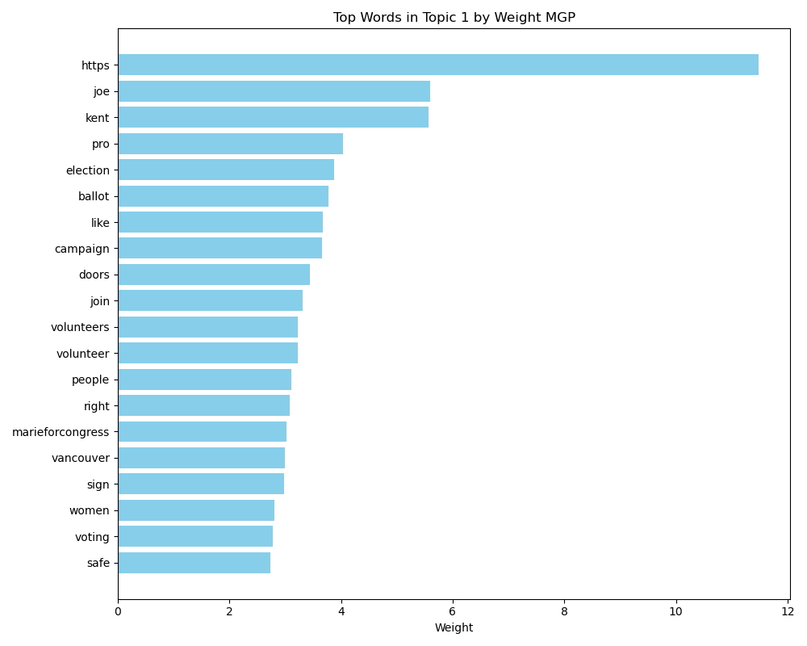
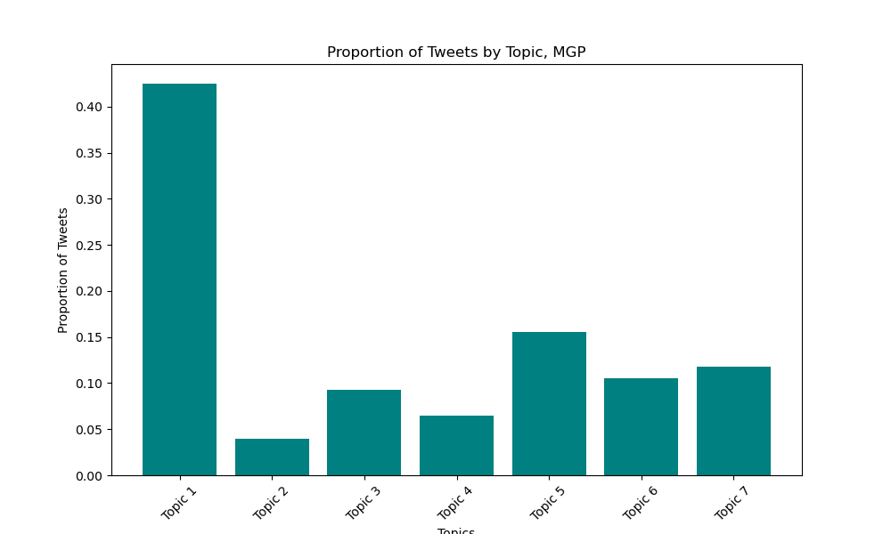

  
<h2 align="center">           </h2>

<h2 align="center">Winning in Trump Country</h2>

  

<h3 align="center">Examining the Twitter Messaging Strategies of Two Democratic Newcomers Who Overcame the Red Tide in the 2022 Midterms </h3>

  
<!-- TABLE OF CONTENTS -->
<!--details-->
  
 Table of Contents 

  <ol>
    <li>
      <a href="#introduction">Introduction</a>
    </li>
    <li>
      <a href="#methodology">Methodology</a>
    </li>
    <li>
      <a href="#data-used">Data Used</a>
    </li>
    <li><a href="#selecting-the-candidates">Selecting the Candidates</a></li>
    <li><a href="#114th-congress-tweets-dataset-sentiment-classification">114th Congress Tweets Dataset Sentiment Classification</a></li>
    <li><a href="#topic-modeling---unsupervised">Topic Modeling - Unsupervised</a></li>
      <ul><li><a href="#baseline-model">Baseline Model</a></li></ul>
      <ul><li><a href="#advanced model">Advanced Model</a></li></ul>
    <li><a href="#marie-gluesenkamp-pérez-topics">Marie gluesenkamp Pérez Topics</a></li>  
    <li><a href="#chris-deluzio-topics">Chris Deluzio Topics</a></li>   
    <li><a href="#topic-comparisons-between-candidates">Topic Comparisons Between Candidates</a></li>
    <li><a href="#insights-and-conclusions">Insights and Conclusions</a></li>
    <!--< li><a href="#future-work">Future Work</a></li>
    <li><a href="#acknowledgments">Acknowledgments</a></li>-->
   </ol>
<!--/details-->

## Introduction

 This project applies Natural Language Processing (NLP) techniques to analyze the twitter messaging strategies of Marie gluesenkamp Pérez (WA-03) and Chris Deluzio (PA-17), Democratic newcomers who competed in two of the most challenging districts for Democrats in the 2022 midterm cycle. 
 
 Given the 2022 midterms were marked by the defeats of many election deniers and January 6th apologists, a secondary focus of this study is to assess the difference in our candidates' messaging strategies against distinct types of opponents— one faced Joe Kent in WA, a 'Kooky' nominee who fully embraced the 2020 election conspiracies, and the other faced Jeremy Shaffer in PA, a mainstream Republican who acknowledged, though reluctantly, Joe Biden's 2020 victory. 
 
 
(<a href="#readme-top">back to top</a>)

 
## Methodology
 
I used classification models to analyze a dataset of 5000 Twitter and Facebook posts by members of the 114th Congress. The dataset was pre-labeled with categories including bias, message nature, and political affiliation. My goal was to train the models to classify tweets based on these labels, which I then applied to my two candidates' tweets leading up to the 2022 midterm elections.
 
I also applied unsupervised topic modeling techniques, beginning with Latent Dirichlet Allocation (LDA) as a baseline method and then using Non-Negative Matrix Factorization (NMF) on Twitter GloVe vectors for refined clustering. After generating the topic groupings, I searched through each candidate's Tweet corpus for words closely associated with these topics to compare how often each candidate messaged on these topics to assess differing strategies. I used cosine similarity calculations within the tweet vector space to determine which words were most semantically similar in each topic. 

(<a href="#readme-top">back to top</a>)

## Data Used
1. PVI score data was sourced from the [Cook Political Report](https://www.cookpolitical.com/cook-pvi/2023-partisan-voting-index/118-district-map-and-list).
2. 2022 Midterm Results were sourced from [The Daily Kos](https://www.dailykos.com/stories/2022/9/21/1742660/-The-ultimate-Daily-Kos-Elections-guide-to-all-of-our-data-sets).
3. The campaign tweets from Marie gluesenkamp Pérez and Chris Deluzio were hand-copied from their twitter accounts [@MGPforCongress](https://twitter.com/mgpforcongress) and [@ChrisforPA](https://twitter.com/chrisforPA)

4. The 114th Congress tweets addended with characterization inputs was sourced from Crowdflower's Data For Everyone Library via [Kaggle](https://www.kaggle.com/datasets/crowdflower/political-social-media-posts/data).

5. GloVe models and vector arrays were sourced from [Jeffrey Pennington, Richard Socher, and Christopher D. Manning of Stanford](https://nlp.stanford.edu/projects/glove/)

(<a href="#readme-top">back to top</a>)

## Selecting the Candidates

**SYNOPSIS:** I determined which candidates to focus on through comparing their 2022 electoral margins with their district's Partisan Voter Index scores (PVI). I ultimately landed on Marie gluesenkamp Pérez in WA-03, and Chris Deluzio in PA-17. Below documents the step-by-step process of determining the candidates of focus 

<b><big>Expand for Detailed Walk-Through Below</big></b>

To identify standout candidates, I devised a 'Performance' metric by calculating the difference between each district's Partisan Voter Index (PVI) and the candidate's electoral margin in 2022. PVI measures how partisan the district is compared to the nation as a whole, based on how the constituents of those districts voted in previous presidential elections. This approach identified those who significantly outperformed their district's typical partisan lean.

Of the top 18 overperforming candidates indicated in the graph above by district title, I narrowed my focus to first-time candidates to avoid any influence of incumbency effects. Mary Peltola from Alaska was also excluded due to the state's use of Ranked Choice Voting, which, while I am personally a fan of RCV, complicates direct comparison of candidates in this context.  

That left me with 6 candidates to consider, all having overperformed their districts' partisan lean by at least 5 points.  The following 4 candidates greatly overperformed in their districts, but were eliminated from consideration for various reasons:

Emilia Sykes would have been fun to analyze (and I love her glasses), but she deleted her campaign account following the election. Adam Frisch, who just barely fell short of victory in CO-03, was initially a candidate of interest, but was excluded due to the sheer volume of his tweets, which, thanks to Elon Musk's recent termination of free API access for Twitter, made data collection too labor-intensive. 

But ultimately, I found myself drawn to the candidate who arguably pulled off the biggest flip of the midterms. Her unique campaign and distinctive messaging strategy provided ample material for analysis, ultimately leading me to...

Marie gluesenkamp Pérez! She faced cuckoo-bird Joe Kent, who expressed some extreme views like supporting the arrest of Dr. Anthony Fauci and endorsing the claims of a stolen 2020 election. In fact, he became the candidate for WA-03 after successfully primarying the serving Republican Congressperson, Jaime Herrera Beutler, one of only 10 republicans who voted to impeach Donald Trump following the events of January 6th. 

The next candidate I wanted to assess took a little more research to come to a decision, but I wanted to find a Democrat who overperformed in their district, while contending against an opponent who was a more mainstream Republican. I landed on...

Chris Deluzio! He competed in a pure toss-up district and significantly outperformed against Jeremy Shaffer, who notably tried to sidestep affirming or denying the 2020 election fraud claims, and even released an ad promising to "protect women's healthcare."  

### Tweet Collection
As mentioned before, the termination of free API access meant manually compiling tweets for Chris Deluzio and Marie gluesenkamp Pérez, and then using a custom parsing script to organize and format these tweets into a structured dataset for analysis. Tweets were manually copied, separated by a '|' delimiter, and then organized into a corpus of around 1000 total tweets. [candidate notebook](MGP and Delozio.ipynb).

(<a href="#readme-top">back to top</a>)

## 114th Congress Tweets Dataset Sentiment Classification

Diving into this 2013-2014 dataset of politicians' social media felt like sorting through a cursed time capsule—fascinating, nostalgic, but ultimately reflecting an unrecognizable reality. Many of the key players in Congress, whose tweets I wrangled here, have fizzled or been replaced. And among the 5000 posts, not a single mention of 'Donald Trump'.

While the dataset does have its utility, its limitations were overwhelming. Nonetheless, for this exercise, I used some advanced classification modeling techniques to attempt to extract insights. The details are outlined below for those interested in the gritty process. The next section, however, is where we'll dive into the more interesting and fruitful analysis.

<b><big>Detailed Process (For the Curious)</big></b>

The dataset of 5000 tweets from 114th Congress members immediately presented a challenge: each tweet was tagged as "partisan" or "neutral," but provided no information on the political party of the tweeter. The data was presented like this:

| label |
| :----------- |
| From: Mitch McConnell (Senator from Kentucky) |
| From: Kurt Schrader (Representative from Oregon) |
| From: Michael Crapo (Senator from Idaho) |

To address this, I used this comprehensive member list from the [C-span 114th Summary Page](https://www.c-span.org/congress/members/?chamber=house&congress=114&all), including images, to match members' names and extract their partisan affiliation. The parsing code developed involved removal of name suffixes and resolving ambiguities in cases of shared last names, such as distinguishing between Rob Bishop (UT-01) and Mike Bishop (MI-08). 

After the data was addended to include each tweeter's political affilitation, several machine learning models were trained to classify tweets based on partisanship and content. This process encorporated Natural Language Processing (NLP) techniques, including TF-IDF vectorization for feature extraction and the application of multiple classifiers such as RandomForest, Naive Bayes, SVM, and Neural Networks within a pipeline structure optimized through GridSearchCV for hyperparameter tuning. 

The optimal models for each classification target—Party, Bias, and Message—were determined based on F1 scores and accuracy. Below are the best-performing models for each category, along with their respective confusion matrices:

- **Bias Prediction**: The Gaussian Naive Bayes Model emerged as the top performer for distinguishing between partisan and neutral tweets.
- **Party Affiliation Prediction**: The Multi-Layer Perceptron Classifier, a type of basic feedforward artificial neural network, was most effective in identifying the political party.
- **Message Category Prediction**: Gaussian Naive Bayes also proved to be the best model for categorizing the content of the tweets.

Word2Vec embeddings were able to enhancing the models' accuracy slightly. The final models were decent at discerning party affiliation, distinguishing between neutral and partisan messages, and categorizing the underlying message themes. 

These models were then applied to analyze the tweets of Marie gluesenkamp Pérez (MGP) and Chris Deluzio, in order to shed light on their campaign messaging strategies in the following section.

(<a href="#readme-top">back to top</a>)

## Analyzing Tweets with Trained Models

After fine-tuning the models on the 114th Congress dataset, I turned my attention to the real test: analyzing the campaign messages of Marie gluesenkamp Pérez (MGP) and Chris Deluzio. Here's the process:

### Analysis Workflow -- From Raw Tweets to Insights
#### Preprocessing Tweets:
Before feeding the tweets into the trained models, the corpus of each candidate was preprocessed:
1. **Tokenization**: The tweets were broken into individual words or 'tokens', making it easier for our models to analyze the text.
2. **Word Averaging with Word2Vec**: 
    - Word2Vec is a model that transforms words into vectors, capturing the semantic relationships between them. For example, Word2Vec understands that 'king' and 'queen' are related in a similar way as 'man' and 'woman'.
    - Word2Vec was used to convert the tokens into vectors, then averaged these vectors for each tweet. This process resulted in a numerical representation that captures the essence of each tweet, while making it digestible for machine learning models.
    - **Note on Lemmatization**: Typically, natural language processing might include a lemmatization step, where words are reduced to their base or 'lemma' (e.g., "running" becomes "run"). However, Word2Vec has the ability to discern the semantic meaning of words in their various forms, so I opted not to lemmatize our tokens. This allows us to retain the variations in the language used in the tweets.

### Normalization and Comparison:
Normalization was applied to the data for a balanced comparison of MGP's and Deluzio's messaging strategies: 
Balancing Volumes-- Due to the different numbers of tweets from each candidate, normalization allowed us to make comparisons based on tweet category proportions, not just total counts.

#### Visualization Analysis and Classifier Performance:

After classifying the tweets and normalizing the data, we employed visualizations to examine the differences in messaging strategies between Marie gluesenkamp Pérez and Chris Deluzio. Each visualization offers insights into specific aspects of their Twitter engagement, based on their classification results.

1. **Message Categories**: 

The distribution of tweets across different message categories (e.g., 'policy', 'attack', 'media') provides insights into the focal points of each candidate's campaign. For example, a higher proportion of 'policy' tweets might indicate a campaign centered on substantive issues, while 'attack' tweets suggest a more confrontational approach.

2. **Partisan vs. Neutral Messages**: Visualizing the split between partisan and neutral tweets can reveal how each candidate balances broad appeal with targeted messaging to their base.

3. **Party Affiliation Predictions**: This visualization might show the predicted party alignment of tweets, offering a perspective on how closely each candidate aligns with their party's typical messaging.

**Performance Caveats**:
It's crucial to note the limitations in classifier performance when interpreting these visualizations. For instance, the 'message' category classifier achieved an accuracy of approximately 36.7%, with varying precision and recall across categories. This variability suggests that while some insights can be gleaned from the classified data, the findings should be taken with caution.

- Categories like 'personal' and 'policy' showed relatively better performance, but this was mostly due to the fact that the dataset was highly imbalanced. Since most of the messages were tagged as 'policy' and 'personal', the models learned to more often predict these categories 
- Categories with lower precision and recall, such as 'constituency' and 'other', had low classification reliability.

The model accuracy is severely limited on the data it was trained on. Due to the human-labeling process for this dataset, the errors and judgments by the topic labelers pass through the model during training, complicated futher by the large imbalance of the labels in certain categories. This problem is exacerbated during the prediction of tweets outside the 114th Congress dataset when introducing the tweetset of Marie gluesenkamp Pérez and Chris Deluzio. This issue could be mitigated by introducing the model to more data, more current data, and balancing along categories. This would be preferable to reduce the data dependency of the model and increase the robustness for general purposes.

While the visualizations provide a structured way to explore the candidates' messaging, the underlying limitations necessitate the use of different NLP techniques to glean important strategy insights. 

(<a href="#readme-top">back to top</a>)

# Topic Modeling - Unsupervised

## Baseline Model 
### Latent Dirichlet Allocation (LDA) on Term Frequency-Inverse Document Frequency (TF-IDF)

As a baseline, I used Latent Dirichlet Allocation (LDA) on Term Frequency-Inverse Document Frequency (TF-IDF) to analyze my candidates' tweets. TF-IDF measures the importance of words in a document (tweet) relative to the corpus (collection of all tweets in the campaign season). However, with only 1000 already-short tweets, LDA's effectiveness may be limited, and so I used this method as a baseline topic modeling method for comparison. 

LDA uses these term frequencies to search for patterns and group things together into topics it thinks are related. It's up to the user to interpret these topics and discern underlying patterns. 

Sorting Marie gluesenkamp Pérez's tweetset into 5 topics created the following key word associations to each topic for MGP:

 

It seems like Topic 1 involves canvassing and GOTV messaging with terms like "volunteer", "join", "doors", "Vancouver" (big population center in the district where running up turnout numbers would be important to win). The other topics' words offer some hints at overarching themes, but they are not as easy to discern as the first topic. 

TF-IDF scores words based on frequency and rarity, then LDA identifies topics based on these scores.  When determining topics, it assigns each word a weight indicating its importance to the topic.  To demonstrate this concept, below is a bar graph showing the importance weights for the words in MGP's first topic.

Now, this is all well and good, but it *is* a baseline model, so let's not dive too deep into it and see if we can go ahead and up the ante a bit with more complex modeling.

(<a href="#readme-top">back to top</a>)

# Advanced Model -- Non-Negative Matrix Factorization (NMF) on 100-Dimensional Twitter GloVe Vectors

<!-- lol what a silly title. It seems almost designed to make you tune out... BUT DON'T! It's actually super cool and impressively useful for Topic Modeling.  -->

### GloVe (Global Vectors for Word Representation)

GloVe is an unsupervised learning algorithm designed by [these dudes](https://nlp.stanford.edu/projects/glove/) at Stanford. It can train on any corpus, but the GloVe model I used was performed on 2 billion tweets, which is important for a few reasons. First, GloVe trains on word-word co-occurence rates, but my model is trained specifically on how words are used together and semantically similar **on Twitter.** Considering the normal corpora used for text classification, Twitter is not newspaper articles, or books, or technical journals, so the word-word codependence rates that develop on twitter are, to a large degree, affected by the character limit itself! Also, the language is more vernacular, and tweets are designed to be shared, commented on, and interacted with. It's just a different semantic universe from other corpora. 

So, given all these aspects of twitter language, I used a model that vectorizes every word into 100-dimensional vectors. Word embeddings can better handle polysemy (words with multiple meanings) by providing contextually appropriate vectors, whereas TF-IDF used in my baseline model treats each word instance identically regardless of semantic context.

### Non-Negative Matrix Factorization

Non-Negative Matrix Factorization (NMF) is a technique that decomposes high-dimensional datasets into lower-dimensional components. Compared to LDA on TF-IDF, NMF can handle denser data representations like GloVe embeddings more naturally, leveraging the semantic information embedded in word vectors. TF-IDF was like sorting through a giant word salad and counting the words that appear, but NMF with twitter-trained GloVe vectors knows that terms like 'Follow' and 'Mention' have related meaning in this semantic universe. This leads to better grouping and more interpretable and distinct topics.

### Process:
After some limited pre-processing, each word within the tweets was converted into a 100-dimensional vector using the GloVe model. The word vectors were averaged to produce a single vector to represents each tweet. These tweet vectors were stacked into a matrix, which served as the input for the NMF model to break down into associated topics. Given the non-negativity constraint inherent in NMF, absolute values of the tweet vectors were utilized to ensure all inputs were non-negative. (I also tried shifting the vector values to all exist in positive space, but it didn't yield a noticeable improvement in the resulting topics.)  

(<a href="#readme-top">back to top</a>)

## Marie gluesenkamp Pérez Topics

Here is the distribution of unlabeled tweet topics that the model found to share semantic similarity (I found 7 topics to be the best grouping parameter).

Once the tweets were grouped , I went through the top 50 tweets associated with each topic, and found the tweets to be best described by the following themes: 

<b><big>
1. MGP Topic 1 -- "Voice for Working Class"</big></b>

<b><big>
2. MGP Topic 2 -- "Digital & Community Engagement"</big></b>

<b><big>
3. MGP Topic 3 -- "Endorsements & Policy Priorities"</big></b>

<b><big>
4. MGP Topic 4 -- "Voter Mobilization Efforts"</big></b>

<b><big>
5. MGP Topic 5 -- "Anti-Extremism"</big></b>

<b><big>
6. MGP Topic 6 -- "Volunteer & Fundraising"</big></b>

<b><big>
7. MGP Topic 7 -- "Defending Rights & Freedoms"</big></b>

The important thing to note here is that each tweet isn't individually put into one distinct category, but rather, each tweet is given a score for the extent to which it is associated with each topic found by NMF. This makes natural sense, because you can talk about multiple things in one statement-- A tweet like "My extreme opponent wants to ban abortion, but I will work to protect choice. That's why I'm endorsed by Planned Parenthood" would have high scores in Topics 3, 5, and 7, but would be less associated with the other topics.  

The interactive graph linked below shows the top 50 tweets associated with each category; hover mouse over datapoint to see full tweet.

(<a href="#readme-top">back to top</a>)

## Chris Deluzio Topics

Here is the distribution of tweet topics for Chris Deluzio that the model found to share semantic similarity.

Once the tweets were grouped , I went through the top 50 tweets associated with each topic, and found the tweets to be best described by the following themes: 

<b><big>
1. Deluzio Topic 1 -- "Union Solidarity & Local Empowerment"</big></b>

<b><big>
2. Deluzio Topic 2 -- "Reproductive Rights & Fighting Extremism"</big></b>

<b><big>
3. Deluzio Topic 3 -- "Community Events"</big></b>

<b><big>
4. Deluzio Topic 4 -- "Jobs & Infrastructure"</big></b>

<b><big>
5. Deluzio Topic 5 -- "Advocacy & Community Solidarity"</big></b>

<b><big>
6. Deluzio Topic 6 -- "Corporate Greed & Economic Fairness"</big></b>

<b><big>
7. Deluzio Topic 7 -- "Defending Rights & Democracy"</big></b>

The interactive graph linked below shows the top 50 tweets associated with each category; hover mouse over datapoint to see full tweet.

(<a href="#readme-top">back to top</a>)

# Topic Comparisons Between Candidates

To quantify and compare tweet frequency on specific topics for each candidate, I analyzed their tweet corpora using keywords and semantically similar terms identified in topic modeling. I used the Twitter-trained GloVe model and cosine similarity to assist in keyword selection to reduce bias. For each keyword, I printed the 50 nearest words using cosine similarity and then divided them into 2 groups -- relevant and irrelevant--  based on their semantic context.

Take the term 'extreme' as an example. The GloVe model identified similar terms like 'radical', 'dangerous', and 'far-right', alongside unrelated terms such as 'fitness', 'depression', and 'jihadist'. I then divided these into the relevant and irrelevant lists, calculated their average vectors, and used the GloVe model to isolate terms associated with my context and exclude terms outside the zone of interest.

The topic-words I chose to explore were:
1. 'extreme'
2. 'volunteer'
3. 'unions'
4. 'endorsement'
5. 'protect'
6. 'folks'
7. 'abortion'
8. 'manufacturing'
9. 'china'
10. 'corporations'

The candidates' tweets were searched for these terms along with a list of semantically-similar terms to gauge how frequently each candidate messaged on the associated topic. The interactive graph below shows the results of these queries, the exact terms used in each list, along with example tweets from each candidate for each category:

<!DOCTYPE html>
<html lang="en">
  <head>
    <meta charset="utf-8">
    <title>Bokeh Plot</title>
    
    
    
  </head>
  <body>
    

  
    
    
  </body>
</html>

# Insights and Conclusions

## 1. Abortion
In the wake of the *Dobbs v. Jackson Women's Health* decision, abortion rights became a huge topic in the 2022 midterms. The results above show that nearly 10% of all tweets from **both** Marie Gluesenkamp Perez and Chris Deluzio touched on abortion rights and reproductive health generally.

#### Messaging Differences:
- **Marie Gluesenkamp Perez:** Her tweets on this topic usually offered a more personal perspective to connect with voters in Washington's 3rd.
  > "Like many moms, I've suffered through the heartbreak of miscarriage – imagine the horror of compounding that with being thrown in JAIL. Mothers deserve autonomy, not a police state."
- **Chris Deluzio:** Deluzio's messaging on the topic focused more on the broader themes of rights and freedoms.  
  > "I think you should have the right to make your own decisions about your pregnancy and health care, and I'll vote in Congress to protect abortion rights."

Despite the low risk of losing abortion access in Washington and Pennsylvania, nearly 1 in 10 tweets from both campaigns touched on the topic. It would be interesting to observe a candidate from a state which increased restrictions, but overall, whether through personal stories or broader rights discussions, abortion was a central topic to these campaigns and the 2022 midterms overall.

## 2. Extremist Opponent

Both campaigns hammered the narrative of "extremism". Marie Gluesenkamp Perez (12% of all tweets) did so slightly more than Chris Deluzio (9.5%), but that is probably due to the fount of source material, given her opponent, Joe Kent's, genuinely insane and extreme positions:

> "Joe Kent says the attack on #January6th 'reeks of an intelligence operation' done by the police. Even today he continues defending the violent mob that ransacked the Capitol. [Link](https://t.co/AyP0ipQEqW)"

> "I'm committed to taking the actions necessary to confront the climate crisis. My opponent thinks climate change is a hoax invented by the Chinese government to make money. #WA03 needs a Member of Congress, not an extreme conspiracy theorist. [Link](https://t.co/BvvQu35wKN)"

> "Joe Kent’s QAnon rants are desperate, weird, and do nothing to improve the lives of people in our district. Anyone who’s tired of this is welcome to join my campaign. I’m running because Congress could use someone who actually knows how to fix things. [Link](https://t.co/hrMAnVXytH)"

Chris Deluzio, running against his moderate opponent with less controversial views, incorporated 'extremism' in a brilliant dual-pronged strategy. First, he highlighted Jeremy Shaffer's silence on things like January6, to imply tacit consent. Shaffer couldn't denounce the extreme views of the far right without alienating those base voters, so Deluzio's campaign used this silence to associate Shaffer with broader extremism effectively:

> "Jeremy Shaffer refuses to denounce the radical right's attack on our elections. His silence speaks volumes."

> "Jeremy, why do you refuse to denounce the insurrection? Why won’t you denounce the assault on our democracy???"

Further, Deluzio frequently connected Shaffer to other more extreme political figures, to paint him with the same brush:

> "My opponent campaigns alongside extremists like Doug Mastriano and Kevin McCarthy, who tried to overthrow our democracy."

> "Jeremy Shaffer just opened a joint campaign office with Doug Mastriano. These extremists are a threat to our freedom."
> Jeremy Shaffer is showing you exactly who he is: Campaigning with insurrectionists, courting endorsements from extremists, and begging formoney from the radical right.'

This method of linking Shaffer with known extremists, despite his moderate stances, and highlighting his silence on extreme issues was a great strategy in the political context of 2022.

## 3. Unions vs. Corporations

Deluzio's campaign emphasized unions and criticized corporate outsourcing, aligning with his district's industrial heritage and union-heavy electorate. He connected his opponent to corporate interests and used the "China" narrative to highlight the need for domestic manufacturing.  

> "Corporate execs have been stiffing folks, crushing unions, & outsourcing jobs to China & all over the planet for way too long. [1/2]"

> "'Corporate executive Jeremy Shaffer really can't stand to be asked about his business in China (or Saudi Arabia!). Corporations like the one that made him rich are raking in millions building up China's infrastructure & selling out folks from #PA17. Need proof? Here:'"

This strategy was creative because recently, China as a cudgel has been used mostly by Republicans. Take a similar district like IN-05, Indianapolis suburbs, where Republican Rep. Victoria Spartz is associating her Republican primary opponent as "China Chuck."

## 4. Ground Game

Marie Gluesenkamp Perez's campaign prioritized ground efforts, with 1 in every 4 of her tweets promoting volunteering, canvassing, and fundraising. She often mentioned Vancouver, the largest metro area in her district, underscoring her strategy to maximize urban turnout and minimize rural conservative opposition. Since so much of her district is rural, solidifying turnout in metro/suburban areas was critical

>'Join me this Saturday for our Longview and  Vancouver canvass kick-offs! First we’ll rally, next I’ll say a few words, and then we’ll all go knock on doors to tell our neighbors about this  important race. RSVP and learn about other upcoming events here:  https://mobilize.us/marieforcongress/',
 
>'Hello from Pacific County, where we’re having fun in the rain at the South Bend Labor Day parade! Our campaign is powered by volunteers like you. Join us at our next event ➡️  http://marieforcongress.com/volunteer/',

**Summary:** Both campaigns effectively leveraged the national issues of 2022, such as abortion rights and anti-extremism, in their strategies. Deluzio capitalized on his district-specific issues, particularly unions, to resonate with his electorate. In contrast, MGP used more of her messaging capital on structuring her ground game, using her voice and reach to mobilize volunteers and supporters to turn out the right votes in the right places. 

(<a href="#readme-top">back to top</a>)

<!---## ACKNOWLEDGMENTS --
-My partner Felipe who helped me manually copy and paste tweets and format them for hours
-Not Paul Kim
